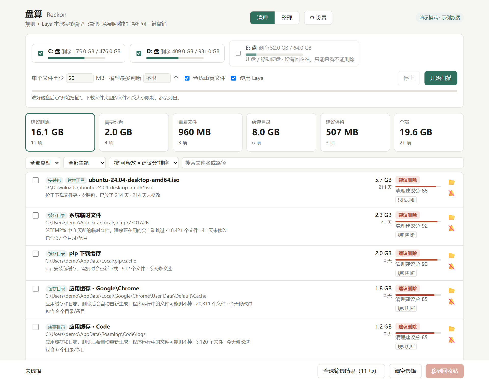
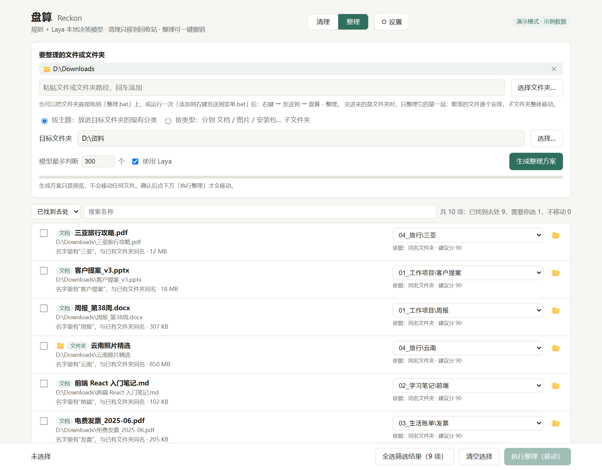
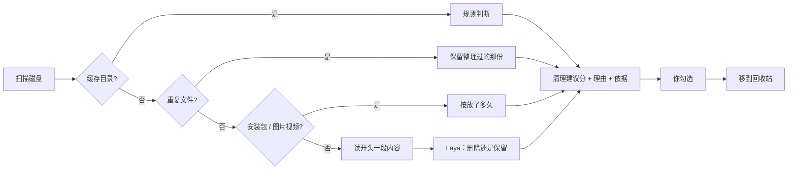
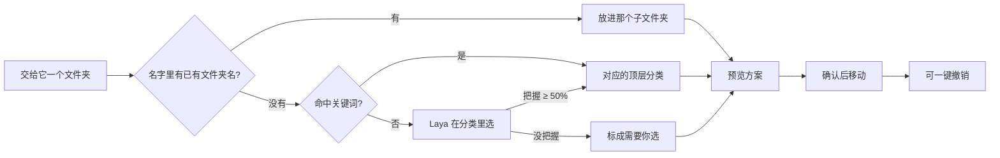

<div align="center">

# 盘算 Reckon

**让本地决策模型先帮你把磁盘盘算一遍：哪些该删，哪些该留，东西该放哪。**

Windows 磁盘清理 + 文件整理 · 规则 + [Laya](https://huggingface.co/convaiinnovations/laya) 本地决策模型 ·
不联网 · 只进回收站 · 整理可一键撤销

中文 · [English](README_EN.md)


<sub>演示模式录制，文件都是虚构的，也没有真正改动任何文件</sub>

</div>

## 它能做什么

- **🧹 清理**：扫描 C/D 盘，给每个候选文件一个「清理建议分」、理由和判断依据，分成
  建议删除 / 需要你看 / 建议保留 / 重复文件 / 缓存目录。勾选后移到回收站，删错了能找回。
- **🗂️ 整理**：把「下载」这类乱七八糟的文件夹交给它，它按你**已经分好类的文件夹**给出去处
  （比如「三亚旅行攻略.pdf」→ `04_旅行\三亚`），或按文件类型分好。预览、修改、确认后才移动，每次都能一键撤销。
- **📖 会读内容**：Word、PPT、Excel、PDF、文本、代码会读开头一段再判断，分得清「课件」和「软件压缩包」。
- **🔒 全在本机**：模型在你电脑上跑，文件名和内容不会上传到任何地方。

## 和普通清理工具有什么不同

普通清理工具只认得缓存和临时文件，对「下载文件夹里这个 1GB 的压缩包能不能删」无能为力。
这个工具会结合位置、类型、多久没动过、文件内容，让决策模型判断「这是学习资料，还是随时能重新下载的安装包」，
**每一项都告诉你为什么**，最后由你拍板。拿不准的一律放进「需要你看」，不替你冒险。

## 截图

**清理**：每一项都有清理建议分、理由和判断依据，拿不准的放进「需要你看」

<div align="center">
<picture>
  <source media="(prefers-color-scheme: dark)" srcset="docs/images/clean-dark.png">
  
</picture>
</div>

**整理**：按目标文件夹的现有分类给出去处，每项都能在下拉框里改

<div align="center">
<picture>
  <source media="(prefers-color-scheme: dark)" srcset="docs/images/organize-dark.png">
  
</picture>
</div>

> 截图和动图都来自演示模式，里面的文件是虚构的。你也可以运行 `Reckon.exe --demo`（或 `python -m reckon --demo`）自己点一点：
> 清理和整理都只是模拟，不会改动任何文件。界面改了之后，用 `python docs/demo/capture.py` 可以重新生成截图和动图。

## 工作原理

**清理**



**整理**



判断规则、阈值和安全边界的细节见 [设计说明](docs/DESIGN.md)。

## 快速开始

### 方式一：下载 exe（推荐）

1. 到 [Releases](https://github.com/Quietcatalpa/reckon/releases) 下载 `Reckon-<版本>-win64.zip`（已包含 Laya 模型，不需要装 Python）；
2. 解压到任意文件夹，双击 **`Reckon.exe`**，浏览器会打开 `http://127.0.0.1:8765/`，关掉黑色窗口就退出。

| 想做什么 | 怎么做 |
|---|---|
| 先看看效果，不碰任何文件（操作都是模拟的） | `Reckon.exe --demo` |
| 整理某个文件夹 | 把它拖到 `Reckon.exe` 上 |
| 在右键菜单里加「发送到 → 盘算 - 整理」 | `Reckon.exe --install-sendto`（去掉：`--remove-sendto`） |

### 方式二：从源码运行

需要 Windows 10/11 和 Python 3.10+。

```bash
pip install -r requirements.txt   # 很轻，不需要 torch
python -m reckon                  # 或者双击 scripts\启动.bat
```

模型二选一，都没有也能用（只按规则判断）：

- 把发布包里的 `model` 文件夹放到 `%LOCALAPPDATA%\Reckon\model`（或用环境变量 `RECKON_MODEL_DIR` 指定）；
- 或者用原版：`pip install laya`（会装 torch），再下载模型
  `python -c "from huggingface_hub import snapshot_download; snapshot_download('convaiinnovations/laya-multilingual')"`。
  之后可以运行 `python scripts/export_onnx.py` 转成 ONNX，结果和原版一致。

可选：`pip install PyMuPDF` 让它也能读 PDF 内容（AGPL-3.0 许可，发布版不带）。

| 想做什么 | 怎么做 |
|---|---|
| 演示模式 / 只用规则 | `python -m reckon --demo` / `python -m reckon --no-laya` |
| 整理某个文件夹 | 把它拖到 `scripts\整理.bat` 上 |
| 「发送到」菜单 | `python -m reckon --install-sendto` |
| 跑测试 | `python -m unittest discover -s tests -v` |
| 打包 exe | `python scripts/export_onnx.py` 然后 `python scripts/build_exe.py` |

扫描结果、判断缓存、整理记录和个人规则都存在 `%LOCALAPPDATA%\Reckon` 里，不在程序目录；删掉这个文件夹就清空了所有记录。

## 个人规则

右上角「⚙ 设置」里可以：

- **永远保留的文件夹**：里面的东西不会出现在清理建议里，也不能从页面上删除；查重时优先保留这里的那一份；
- **以后不再提示**：清理列表每行右边的 🔕，点过的项以后不再出现，可以在设置里恢复；
- **整理时的默认去处**：比如安装包总是放到 `D:\软件安装包`，优先于其他判断；
- **判断阈值**：「建议删除」「需要你看」两条线和规则权重。个人资料、备份、疑似重复等不管阈值怎么调，最多只到「需要你看」。

## 要多久

以一台约 30 万个文件、C+D 两个盘的电脑为例（普通笔记本 CPU，实测）：

| | 第一次扫描 | 以后再扫描 |
|---|---|---|
| 遍历文件 | 约 30 秒 | 约 30 秒 |
| 查找重复文件（4 线程并行） | 约 40 秒 | 约 20 秒 |
| Laya 逐个判断（约 850 个文件，全部判断） | 约 10 分钟 | **只判断新的和改过的**，其余沿用上次结论 |
| **合计** | **约 12 分钟** | **约 1.5 分钟** |

期间电脑照常用，中途可以停止：模型会先判断规则拿不准的、再判断规则认为该删的，停下时最要紧的已经判断完了。
想更快可以在「模型最多判断」里填个数，或取消「查找重复文件」「使用 Laya」（1 分钟左右出结果）。

## 安全

- 清理只移到**回收站**：删除前会确认这一项一定能进回收站（本机硬盘、回收站没被关掉、没超过回收站容量上限），
  放不进去的直接跳过并告诉你原因，绝不会被 Windows 悄悄永久删除。
- 删除前再核对一次，扫描后被改过的文件不删；删重复副本前确认保留的那份还在。
- 系统目录、已安装的软件、conda 环境、`.git` 不扫描也不整理；程序组件（dll 等）不会被建议删除。
- 桌面/文档里的资料、聊天软件收到的文件，最多只到「需要你看」，不会被直接建议删除。
- 备份文件（.bak / .old 等）可能是唯一的一份，最多到「需要你看」；超大文件只抽样比对过的重复也只算「疑似」，删之前一律完整比对。
- 临时文件夹这类目录，扫描后里面有新改动就不动；直接交给「整理」的如果是软件目录（或在软件目录里面），会拒绝。
- 页面上的结果带编号：在别的页面重新扫描后，旧页面上的勾选会作废，不会错删成别的文件；删除、整理、撤销不会同时进行。
- 「清理建议分」是规则和模型加权算出来的排序依据，**不是**「删了没事」的概率，每项都会写明依据（完整比对 / 读过内容 / 只看文件信息 / 只按规则）。
- 整理有记录、可撤销：每移动一项之前先写记录，即使中途关掉程序也能撤销；有文件放不回去时可以处理后再试。
  重名自动加 ` (2)`，从不覆盖。
- 服务只监听 127.0.0.1，并校验随机令牌，其他网页调用不了。

## 常见问题

**会不会误删？**
工具本身不会删除任何东西，只会把你勾选的项移到回收站。确认没问题后你自己清空回收站，空间才真正腾出来。

**需要显卡吗？**
不需要。Laya 在 CPU 上每个文件不到 1 秒，而且文件没变就不重复判断；有 NVIDIA 显卡会自动用上，更快。

**Laya 判断得准吗？**
目前只做过一次**初步测试**：在「删除还是保留」这个问题上用 12 个真实文件试，答对 9 个，另外 3 个在 50% 左右，会落进「需要你看」。
样本太少，不能当作准确率。现在另有一份 68 条的虚构评估集（见[设计说明](docs/DESIGN.md)），默认设置下没有出现「该留的被建议删除」。
所以最终分数是规则和模型一起算的，拿不准的交给你。主题分类它不太擅长，所以整理时优先用文件夹同名和关键词。

**为什么用 Laya，不用大模型或 Jev？**
Laya 是开源的、能完全在本机运行的「决策模型」：不生成文字，只在给定选项里选并给出概率，快而且不会答非所问。
[Jev](https://www.tomshardware.com/tech-industry/artificial-intelligence/typesafe-ais-jev-offers-an-alternative-to-llms-that-claims-to-be-193x-faster-and-445x-cheaper-system-one-type-model-is-bespoke-for-probabilistic-decision-making)
是同类的云端付费接口，用它就得把你的文件名和内容发出去。

**支持 macOS / Linux 吗？**
暂时只支持 Windows。

## 致谢

- [Laya](https://huggingface.co/convaiinnovations/laya)（Convai Innovations）：本地决策模型
- [Send2Trash](https://github.com/arsenetar/send2trash)、[python-docx](https://github.com/python-openxml/python-docx)、
  [python-pptx](https://github.com/scanny/python-pptx)、[openpyxl](https://openpyxl.readthedocs.io/)、[PyMuPDF](https://github.com/pymupdf/PyMuPDF)

## 许可证

[MIT](LICENSE)。Laya 模型权重和移植的少量代码为 Apache-2.0，发布包附带的运行库各有许可证，见 [第三方许可说明](THIRD_PARTY_NOTICES.md)。
可选依赖 PyMuPDF 为 AGPL-3.0，不随发布包分发。
