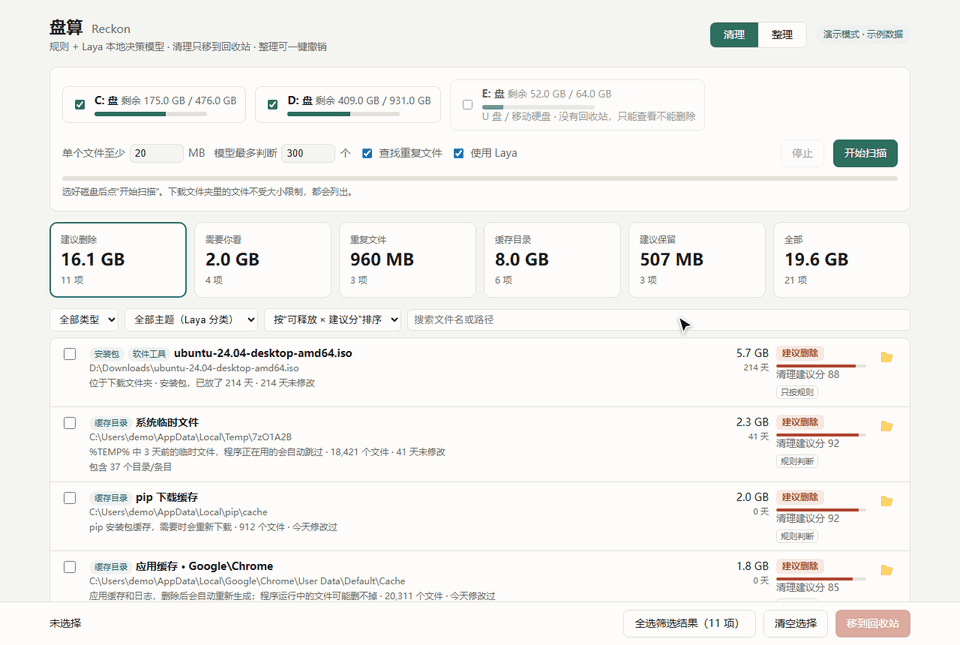

<div align="center">

# Reckon 盘算

**Let a local decision model reckon through your disk first: what to delete, what to keep, and where things belong.**

Windows disk cleanup + file organizing · rules + the [Laya](https://huggingface.co/convaiinnovations/laya) local decision model ·
fully offline · deletes only to the Recycle Bin · every organize run can be undone

[中文](README.md) · English




<sub>Recorded in demo mode with made-up files; nothing on disk was touched. The UI is in Chinese.</sub>

</div>

## What it does

- **🧹 Clean**: scans your drives and gives every candidate a *cleanup score*, the reasons behind it and the evidence it is based on,
  sorted into *suggest delete / please review / suggest keep / duplicates / cache folders*. Selected items go to the Recycle Bin.
- **🗂️ Organize**: hand it a messy folder such as Downloads and it proposes a destination inside **the folders you already use**
  (e.g. `Sanya travel guide.pdf` → `04_Travel\Sanya`), or sorts by file type. Preview, adjust, confirm — and undo with one click.
- **📖 Reads content**: Word, PowerPoint, Excel, text and code files are read (first ~600 characters) before judging,
  so it can tell lecture notes from a re-downloadable installer archive. (PDF text needs the source version with PyMuPDF;
  the exe judges PDFs by name, location and age only.)
- **🔒 Local only**: the model runs on your machine; no file names or contents leave it.

Unlike classic cleaners that only know caches and temp folders, Reckon combines location, type, age and content, and lets a decision
model judge *"is this study material, or an installer you can download again?"* — every item says why, and anything uncertain goes to
*please review* instead of being deleted for you.

## Quick start

### Option 1: download the exe (recommended)

1. Download `Reckon-<version>-win64.zip` from [Releases](https://github.com/Quietcatalpa/reckon/releases) (model included, no Python needed).
2. Unzip anywhere and double-click **`Reckon.exe`**. Your browser opens `http://127.0.0.1:8765/`; close the console window to quit.

| To… | Do |
|---|---|
| try it without touching any file (all actions simulated) | `Reckon.exe --demo` |
| organize a folder | drag it onto `Reckon.exe` |
| add *Send to → 盘算 - 整理* to the right-click menu | `Reckon.exe --install-sendto` (remove: `--remove-sendto`) |

### Option 2: run from source

Windows 10/11, Python 3.10+.

```bash
pip install -r requirements.txt   # lightweight, no torch
python -m reckon                  # or double-click scripts\启动.bat
```

For the model, either copy the `model` folder from the release into `%LOCALAPPDATA%\Reckon\model` (or point `RECKON_MODEL_DIR` at it),
or `pip install laya` (pulls in torch) and download `convaiinnovations/laya-multilingual` from Hugging Face.
Without a model it still works, using rules only. `pip install PyMuPDF` (AGPL-3.0, not shipped in the release) enables reading PDF text.

Tests: `python -m unittest discover -s tests -v`. Build the exe: `python scripts/export_onnx.py` then `python scripts/build_exe.py`.

Scan results, the judgment cache, organize history and personal rules live in `%LOCALAPPDATA%\Reckon`, not next to the program.

## How long it takes

Measured on an ordinary laptop CPU with ~300k files on two drives:

| | first scan | later scans |
|---|---|---|
| walk the drives | ~30 s | ~30 s |
| find duplicates (4 threads) | ~40 s | ~20 s |
| Laya judges ~850 files (all of them) | ~10 min | **only new or changed files**, the rest reuse earlier results |
| **total** | **~12 min** | **~1.5 min** |

The model judges the most uncertain files first, so stopping early still leaves the important ones done.
No GPU needed: the exe runs the model on the CPU only; from source with a CUDA build of torch it uses an NVIDIA GPU.

## Safety

- Only the **Recycle Bin**: before deleting, Reckon checks that the item will really go there — local fixed drive, Recycle Bin not
  disabled, and not larger than that drive's Recycle Bin limit (otherwise Windows would silently delete it for good). Items that
  wouldn't fit are skipped with an explanation.
- Files changed since the scan are not deleted. Before deleting a duplicate, both copies are compared byte by byte and the kept copy
  must be unchanged. Very large files that were only sample-compared count as *suspected* duplicates.
- System folders, installed programs, conda environments and `.git` are never scanned or organized; program components (dlls, …) are
  never suggested for deletion; handing a program folder to *Organize* is refused.
- Personal documents, backups (`.bak`, `.old`, …) and files received through chat apps top out at *please review*.
- Temp folders and similar are skipped if anything inside changed after the scan.
- Results carry IDs: after rescanning in another tab, stale selections are rejected; delete / organize / undo never run concurrently.
- Organize writes its record *before* each move, so even a crash mid-way can be undone; undo can be retried if something couldn't be restored.
- The *cleanup score* is a weighted rules + model score for ranking, **not** a calibrated "safe to delete" probability.
- The server listens on 127.0.0.1 only and checks a random per-session token.

## Personal rules

*设置* (Settings) lets you set **folders to always keep**, **items never to suggest again** (the bell icon on each row), **default destinations
per file type** when organizing, and the **thresholds / rule weight** (sliders with a live preview of how the current results would be sorted).
*说明* (Help) and the *?* marks next to every option explain each score, column and tag. Personal files, backups and suspected duplicates stay at
*please review* whatever the thresholds are.

## How accurate is Laya?

On a first informal check with 12 real files it matched 9, with the other 3 near 50% (landing in *please review*). A hand-labeled,
made-up evaluation set of 68 cases ([docs/eval](docs/eval)) is used to compare settings: with the defaults, nothing that should be kept
is suggested for deletion. The set is small and subjective — treat the numbers as a regression guard, not an accuracy claim.
Details (rules, thresholds, measurements, why no batching / no int8) are in the [design notes](docs/DESIGN.md) (Chinese).

## License

[MIT](LICENSE). The Laya weights and a small amount of ported code are Apache-2.0; bundled runtimes have their own licenses — see
[THIRD_PARTY_NOTICES.md](THIRD_PARTY_NOTICES.md).
